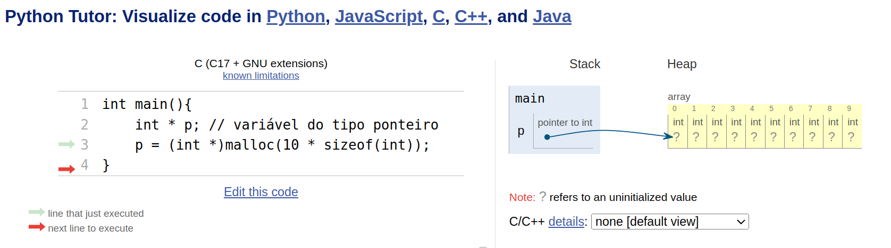
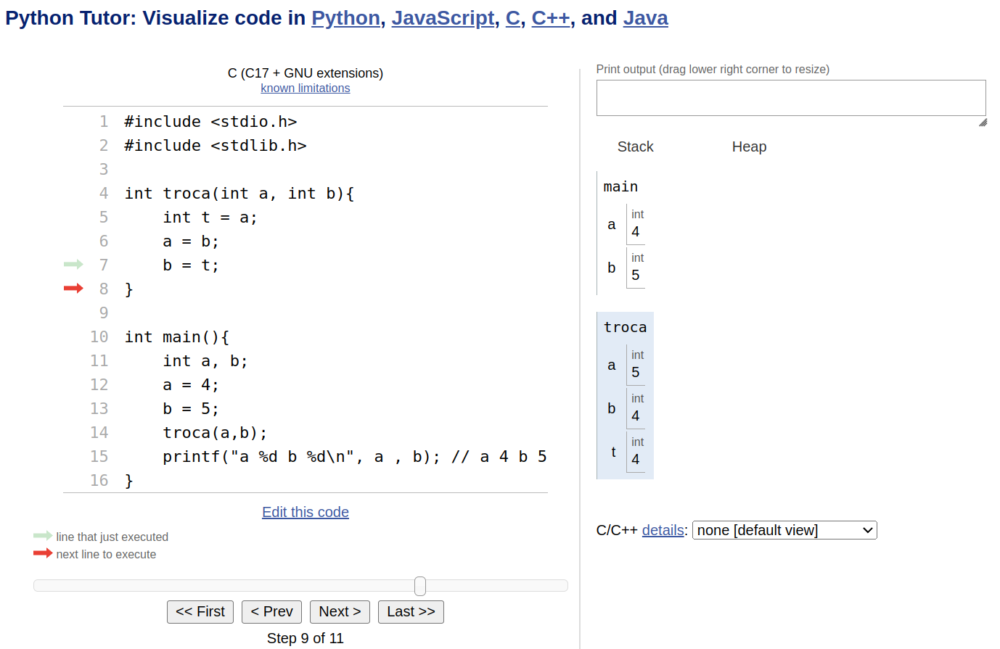
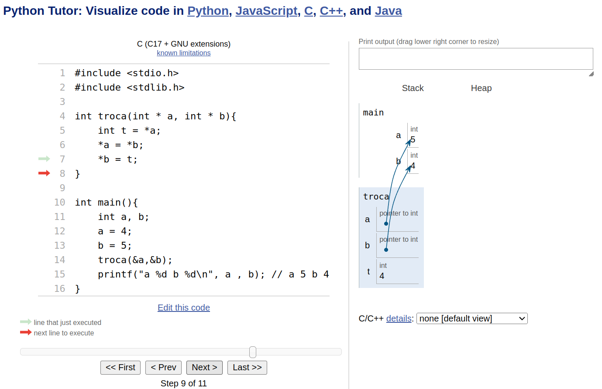
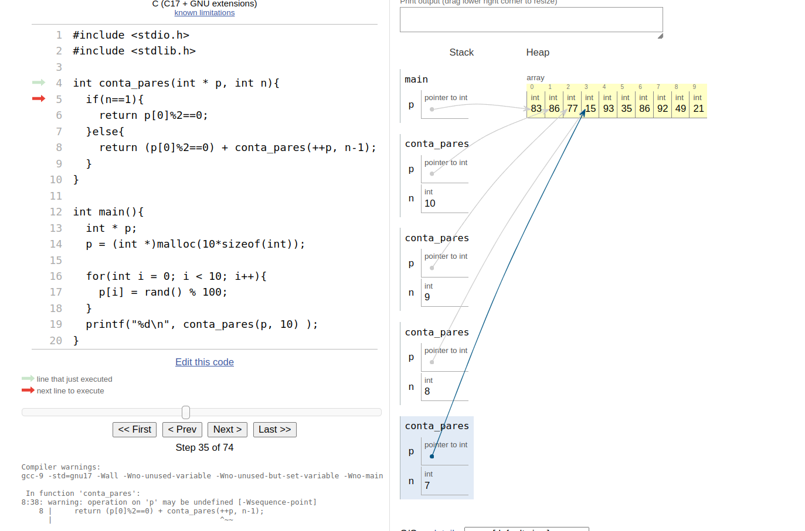

# Programando com ponteiros

Até o momento, utilizamos a memória de algumas maneiras diferentes.

Variáveis globais que podem ser vistas por todas as funções.

```c++
#include <stdio.h>

int a; // variáveis globais


int func(int c){ // variável local
    int x; // variável local
    return 2;
}

int main(){
    int b; //variável local 
    int n;
    scanf("%d", &n);
    int v[n]; // variável com tamanho dinâmico
}
```

Contudo, podemos pedir em tempo de execução para o sistema operacional para alocar mais memória e/ou desalocar mais memória. Isso pode ser feito através de ponteiros.

# Alocação dinâmica

A variável do tipo ponteiro guarda um endereço de memória.

```c++
#include <stdlib.h> // funcao malloc
int main(){
    int * p; // variável do tipo ponteiro
    p = (int *)malloc(10 * sizeof(int));    
}
```

O site python Tutor mostra o que acontece na memória durante a execução do código.



A variável p guarda o endereço de uma região de memória numa área chamada heap.

```c++
#include <stdlib.h> // funcao malloc
int main(){
    int * p; // variável do tipo ponteiro
    p = (int *)malloc(10 * sizeof(int));    
    
    for(int i = 0; i < 10; i++){
        scanf("%d", &p[i]);
    }
    ... 
}
```

## Variável do tipo ponteiro

O ponteiro permite manipular a região de memória apontada por ele
```C++
#include <stdio.h>
#include <stdlib.h>

int main(){
    int i = 0;
    int * p;

    printf("%d\n", i); // 0
    p = &i;
    *p = 2; 
    printf("%d\n", i); // 2
}
```

Hum... então deve ser por isso que passamos o endereço de uma variável para a função `scanf()`. 

Com a variável ponteiro podemos passar um "caminho" para alterar uma variável. 

Considere o seguinte exemplo:

```c++
#include <stdio.h>
#include <stdlib.h>

int troca(int a, int b){
    int t = a;
    a = b;
    b = t;
}

int main(){
    int a, b;
    a = 4;
    b = 5;
    troca(a,b);
    printf("a %d b %d\n", a , b); // a 4 b 5
}
```



Neste exemplo, as variáveis que são trocadas são as variáveis locais da função troca e as variáveis `a` e `b` da função main continuam inalteradas. 

Agora, vamos fazer o mesmo exemplo utilizando ponteiros.


```c++
#include <stdio.h>
#include <stdlib.h>

int troca(int * a, int * b){
    int t = *a;
    *a = *b;
    *b = t;
}

int main(){
    int a, b;
    a = 4;
    b = 5;
    troca(&a,&b);
    printf("a %d b %d\n", a , b); // a 5 b 4
}
```



# Ponteiros para vetores

```C++
#include <stdio.h>
#include <stdlib.h>

int main(){
    int * p;
   p = (int *)malloc(10*sizeof(int));

   printf("%p\n", p); //0x5402040
   printf("%p\n", p+1); //0x5402044 
   printf("%p\n", p+2); //0x5402048
   
   *p = 2; //p[0] = 2;
   *(p+1) = 3 //p[1] = 3
   *(p+2) = 5 //p[2] = 5 


}
```

Com esse recurso, eu posso fazer programas recursivos bem diferentes.

```C++
#include <stdio.h>
#include <stdlib.h>

int conta_pares(int * p, int n){
  if(n==1){
    return p[0]%2==0;
  }else{
    return (p[0]%2==0) + conta_pares(++p, n-1);
  }
}

int main(){
  int * p;
  p = (int *)malloc(10*sizeof(int));

  for(int i = 0; i < 10; i++){
    p[i] = rand() % 100;
  }
  printf("%d\n", conta_pares(p, 10) );
}
```




# Ponteiros para registros

```C++
struct Reg3Int{
    int a, b,c;
};
```

Agora, podemos criar uma variável ponteiro para esse registros
e alocar memória assim

```c++
struct Reg3Int * p;
p = (struct Reg3Int) malloc( sizeof(struct Reg3Int));
```

Para manipular os campos do registros podemos fazer da seguinte maneira:

```C++
(*p).a = 1;
(*p).b = 1;
(*p).c = 1;
```

ou então assim

```C++
p->a = 1;
p->b = 1;
p->c = 1;
```

# Revisitando struct Data

```
struct Data{
	int dia;
	int mes;
	int ano;
	char evento[51];
}

typedef struct Data Data;


Data criar_data(int dia, Mes mes, int ano, char evento[]){
	Data d;
	d.dia = dia;
	d.mes = mes;
	d.ano = ano;
	int i;
	for(i = 0; evento[i] != '\0'; i++){
		d.evento[i] = evento[i];
	}
	d.evento[i] = '\0';
	//strcpy(d.evento, evento);
	return d;
}
void imprime_data(Data d){
	printf("%02d/%02d/%4d: %s\n", d.dia, d.mes, d.ano, d.evento);
}

int main(){
	Data d1 = criar_data(7,9,1822,"Dia da Independencia");
	imprime_data(d1);
}

```

Usando ponteiros:

```C++
#include <stdio.h>
#include <string.h>

struct Data{
	int dia;
	int mes;
	int ano;
	char evento[51];
};

typedef struct Data Data;


void criar_data(Data * d, int dia, int mes, int ano, char evento[]){
	
	d->dia = dia;
	d->mes = mes;
	d->ano = ano;
	strcpy(d->evento, evento);
}

void imprime_data(Data* d){
	printf("%02d/%02d/%4d: %s\n", d->dia, d->mes, d->ano, d->evento);
}

int main(){
	Data d1;
	criar_data(&d1,7,9,1822,"Dia da Independencia");
	imprime_data(&d1);
}
```

# Revisitando BigInt

```C++
#include <stdio.h>
#include <string.h>
#include <stdlib.h>
#include <time.h>

typedef struct bigint {
	char digit[101];
	int size;
} bigint;

void reverse(char s[]){
	int i = 0;
	int j = strlen(s)-1;
	while(i<j){
		char t = s[i];
		s[i] = s[j];
		s[j] = t;
		i++;
		j--;
	}
}


bigint init_bigint(char s[]){
	bigint b;
	b.size = strlen(s);
	strcpy(b.digit, s);
	reverse(b.digit);
	return b;
}


void incremento(bigint * b){
	for(int i = 0; i < b->size; i++){
		if( b->digit[i] < '9'){
			b->digit[i]++;
			return ;
		}else{
			b->digit[i] = '0';
		}
	}
	b->digit[b->size] = '1';
	b->size++;
}

void imprime_bigint(bigint * b){
	printf("bigint: ");
	for(int i = b->size-1; i >= 0; i--)
		printf("%c", b->digit[i]);
	printf("\n");
}

int main(){
	bigint b = init_bigint("9999");
	incremento(&b);
	imprime_bigint(&b);
}
```


# ListaSequencial com tamanho dinâmico

```C++
#include <stdio.h>
#include <stdlib.h>
#include <string.h>

typedef struct ListaDinamica{
	int * v;
	int tamanho_atual;
	int tamanho_maximo;
} ListaDinamica;

ListaDinamica * create_lista( ){
	ListaDinamica * l = (ListaDinamica *)malloc(sizeof(ListaDinamica));
	l->tamanho_maximo = 1;
	l->tamanho_atual = 0;
	l->v = (int *)malloc(l->tamanho_maximo*sizeof(int));
	return l;
}

void add(ListaDinamica * l, int valor){
	
	
	if(l->tamanho_atual < l->tamanho_maximo){
		l->v[l->tamanho_atual] = valor;
		l->tamanho_atual++;
	}else{
		int * p;
		p = (int *)malloc(2*l->tamanho_maximo*sizeof(int));
		
		for(int i = 0; i < l->tamanho_maximo; i++){
			p[i] = l->v[i];
		}
		free(l->v);
		l->v = p;
		l->tamanho_maximo = 2*l->tamanho_maximo;
		add(l, valor);
	}
}

void mostra_lista(ListaDinamica * l){
	printf("[");
	for(int i = 0; i < l->tamanho_atual; i++){
		printf("%d ", l->v[i]);
	}
	printf("]\n");
}

int main(){
	ListaDinamica* l;
	l = create_lista();
	mostra_lista(l);
	for(int i = 0; i < 20; i++){
		add(l, i);
		mostra_lista(l);
		
		printf("%p\n", &l->v[0]);
	}
	
	//for(int i = 0; i < 10; i++){
	//	add(l, i);
	//}
}


```


